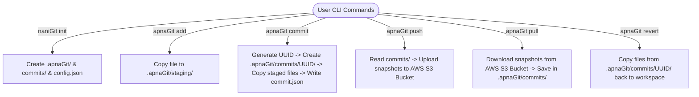
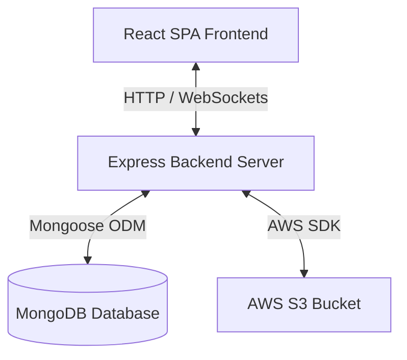

# naniGit - Custom Version Control System & GitHub Clone

`naniGit` is a custom, lightweight Git-like Version Control System (VCS) command-line interface paired with a full-stack GitHub clone web application built using the MERN (MongoDB, Express, React, Node.js) stack and Socket.io.

---

## 🏗️ System Architecture

The project is split into two primary components:
1. **Custom VCS CLI (`naniGit`)**: A local command-line tool written in Node.js that enables staging, committing, and uploading/downloading repository snapshots to/from AWS S3.
2. **Web Application (GitHub Replica)**: A web dashboard to view repositories, track issues, display contribution heatmaps, and manage user profiles.

### 1. Custom VCS CLI Architecture



### 2. Web Application Architecture



---

## ⚙️ Custom VCS CLI Commands

To run the custom version control system, run the backend package CLI runner:

*   **Initialize Repository**: 
    ```bash
    node backend-main/index.js init
    ```
    Initializes a new local repository by creating the `.apnaGit` directory and necessary metadata.

*   **Stage Files**:
    ```bash
    node backend-main/index.js add <filePath>
    ```
    Stages a file for the next commit by copying it to the staging folder.

*   **Commit Changes**:
    ```bash
    node backend-main/index.js commit "Your commit message"
    ```
    Creates a unique commit snapshot containing all staged files.

*   **Push to Cloud**:
    ```bash
    node backend-main/index.js push
    ```
    Uploads all local commit snapshots to the configured AWS S3 bucket.

*   **Pull from Cloud**:
    ```bash
    node backend-main/index.js pull
    ```
    Fetches all commit snapshots from the AWS S3 bucket.

*   **Revert to Commit**:
    ```bash
    node backend-main/index.js revert <commitID>
    ```
    Reverts the local workspace directory back to the state of the specified commit ID.

---

## 📡 Web Application API Endpoints

The Express server runs by default on port `3000` (or the `PORT` env variable).

### 🔑 Authentication & Users
*   `POST /signup` - Registers a new user.
*   `POST /login` - Authenticates a user and returns a JWT token.
*   `GET /allUsers` - Retrieves a list of all registered users.
*   `GET /userProfile/:id` - Fetches user profile info (repositories, description, etc.).
*   `PUT /updateProfile/:id` - Updates user profile details.
*   `DELETE /deleteProfile/:id` - Deletes a user profile.

### 📁 Repositories
*   `POST /repo/create` - Creates a new repository.
*   `GET /repo/all` - Retrieves all repositories.
*   `GET /repo/:id` - Fetches a specific repository by its database ID.
*   `GET /repo/name/:name` - Fetches a repository by name.
*   `GET /repo/user/:userID` - Retrieves all repositories owned by a specific user.
*   `PUT /repo/update/:id` - Updates repository metadata.
*   `DELETE /repo/delete/:id` - Deletes a repository.
*   `PATCH /repo/toggle/:id` - Toggles repository visibility between Public and Private.

### 🐛 Issue Tracker
*   `POST /issue/create` - Logs a new issue in a repository.
*   `GET /issue/all` - Retrieves all logged issues.
*   `GET /issue/:id` - Fetches a single issue by its ID.
*   `PUT /issue/update/:id` - Updates the status or details of an issue.
*   `DELETE /issue/delete/:id` - Deletes an issue.

---

## 🚀 Installation & Running

### Prerequisites
*   Node.js (v18+)
*   MongoDB Instance
*   AWS S3 Bucket (for VCS CLI push/pull functionality)

### Setup & Run
1. **Clone the repository**:
   ```bash
   git clone https://github.com/Nanitech-1/version-control-system.git
   cd version-control-system
   ```

2. **Configure Environment Variables**:
   Create a `.env` file in the `backend-main` folder:
   ```env
   PORT=3000
   MONGODB_URI=your_mongodb_connection_string
   S3_BUCKET=your_s3_bucket_name
   AWS_ACCESS_KEY_ID=your_aws_access_key
   AWS_SECRET_ACCESS_KEY=your_aws_secret_key
   ```

3. **Start the Backend Server**:
   ```bash
   cd backend-main
   npm install
   npm run start
   ```

4. **Start the Frontend Application**:
   ```bash
   cd ../frontend-main
   npm install
   npm run dev
   ```
